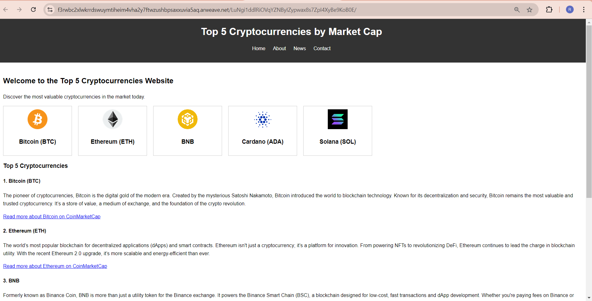
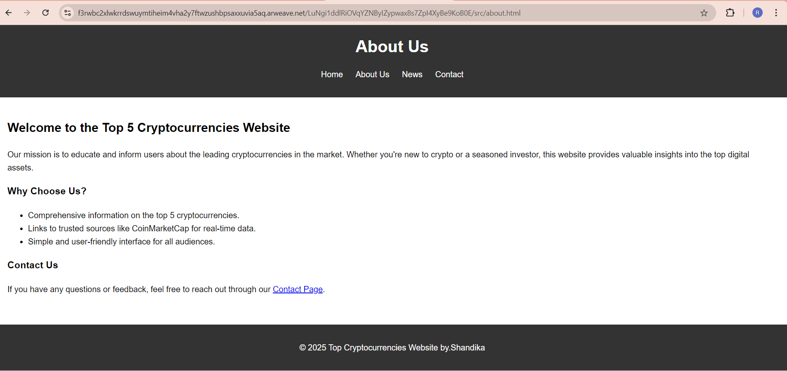
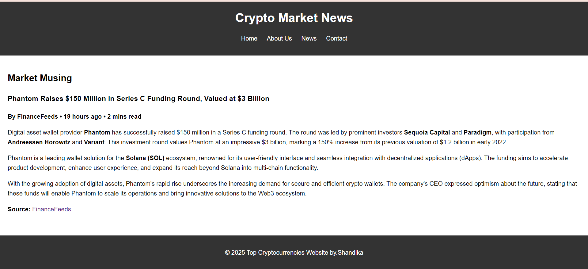
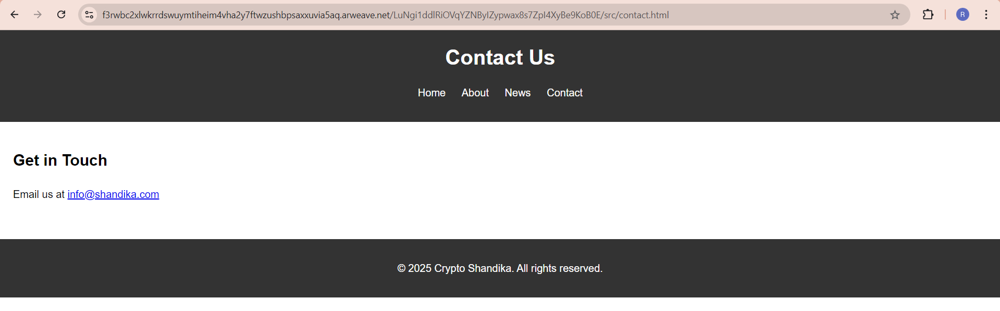

Top 5 Cryptocurrency Website by Shandika

Welcome to the Top 5 Cryptocurrency Website, a modern platform designed to educate and inform users about the top cryptocurrencies in the world. This project is created with passion and precision by Shandika, a dedicated developer with a keen interest in blockchain and cryptocurrency technologies.

About the Website
The website provides detailed information about leading cryptocurrencies such as Bitcoin, Ethereum, Solana, and more. With a clean, user-friendly interface, visitors can explore:

Home Page: A welcoming introduction to the world of cryptocurrencies.
About Us Page: Insights into the purpose and vision behind the website.
News Page: Stay updated with the latest developments in the cryptocurrency market.
Contact Page: Get in touch with the creator for feedback or inquiries.
Project Highlights
This website is lightweight, responsive, and seamlessly deployed using DragonDeploy, making it accessible to anyone interested in the crypto ecosystem.

Project Structure
The project follows a clean and organized structure:

Edit
├── index.html # Home page  
├── assets/  
│ ├── css/  
│ │ └── style.css # Styles for the website  
│ └── images/ # Images used in the website  
├── src/  
│ ├── about.html # About Us page  
│ ├── contact.html # Contact page  
│ └── news.html # News page

How to Deploy (DragonDeploy)
The website is hosted on DragonDeploy, a decentralized deployment platform. Follow these steps to deploy:

Prepare Your Project

Ensure your project includes all required files (HTML, CSS, and images).
Connect Wallet and Set Permissions

Use your wallet (e.g., ArConnect) to configure the necessary permissions.
Upload Your Project

Drag and drop your project folder directly into DragonDeploy.
Verify and confirm the deployment.
Once completed, you’ll receive a unique link to access your website.

Features
Educational Content: Comprehensive details about top cryptocurrencies.
Latest Market News: Stay informed with up-to-date information.
Responsive Design: Optimized for viewing across all devices.
Decentralized Hosting: Powered by DragonDeploy for security and reliability.

Creator’s Note
Hi, I’m Shandika, a passionate developer who loves building innovative projects in the blockchain space. This website is part of my journey to explore and contribute to the Web3 ecosystem.

Feel free to explore, learn, and share your thoughts about this project. Your feedback is always welcome!

Contact
For feedback or collaboration opportunities, feel free to reach out:

Email: shandika2001@gmail.com
LinkedIn: ShandikaGalih
